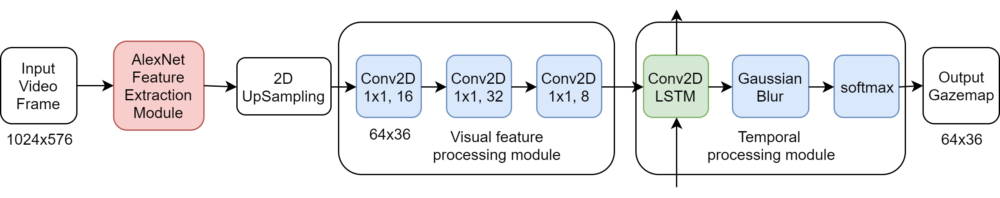

# Driver Attention Prediction Model

## Project Introduction:

This project accompanies the paper **_Predicting Driver Attention in Critical Situations_** (https://arxiv.org/abs/1711.06406)

## Demo:


### Video demos 
<a href="http://www.youtube.com/watch?feature=player_embedded&v=IcAtJ0CvYuQ" target="_blank">
     
</a>

### Model structure


## Using Our Code:
### Dependencies
The code was written with Tensorflow 1.5, Keras 2.1.5 and some other common packages. A Docker image (blindgrandpa/tf150_kr215) was prepared for running the code. The Dockerfile of that Docker image is at `./docker_images/tf150_kr215/` in this repo. The Dockerfile lists all the dependencies. In order to use this Docker image to run our code, you need to have nvidia-docker installed.


### Use our model to do inference on your videos
If you want to use our model to generate predicted driver attention maps for your videos, please follow the steps below. 

1. Put your videos into the directory `./data/inference/camera_videos/`

2. Parse your videos into frames. 
Please run the following command to parse your videos into frames. `video_suffix` should be the suffix of your video files. `sample_rate` is for how many frames per second you want to have predicted attention maps. 3 Hz is recommended. We assume that there is no underscore in the names of your video files. 
```bash
python parse_videos.py \
--video_dir=data/inference/camera_videos \
--image_dir=data/inference/camera_images \
--sample_rate=3 \
--video_suffix=.mp4
```


3. Convert video frames to Tensorflow tfrecords files. All the video frames will be divided into `n_divides` tfrecords files.
The frames of each video will be divided into groups that have at most `longest_seq` frames. 
You can change `longest_seq` according to the memory size of your computer.
```bash
python write_tfrecords_for_inference.py \
--data_dir=data/inference \
--n_divides=2 \
--longest_seq=35
```


4. Download the pre-trained weights. Download [this zip file](https://drive.google.com/file/d/1q_CgyX73wrYTAsZjDF9aMXNPURcUmWVy/view?usp=sharing) and unzip it to `./`

5. Download the pre-trained weights of Alexnet. Downlaod [bvlc_alexnet.npy](https://www.cs.toronto.edu/~guerzhoy/tf_alexnet/bvlc_alexnet.npy) and put it at `./`


6. Predict driver attention maps by runnning the following command. The predicted attention maps will be at `./pretrained_models/model_for_inference/prediction_iter_0/`. The files will be named in the pattern "VideoName_TimeInMilliseconds.jpg".
```bash
python infer.py \
--data_dir=data \
--model_dir=pretrained_models/model_for_inference
```


### Train our model from scratch with your data
If you want to train our model from scratch with your videos, please follow the steps below. 

1. Put your camera videos and gaze map videos of your training set and validation set into the following directories `./data/training/camera_videos/`, `./data/training/gazemap_videos/`, `./data/validation/camera_videos/` and  `./data/validation/gazemap_videos/`


2. Parse your videos into frames. 
Please run the following commands to parse your videos into frames. `video_suffix` should be the suffix of your video files. `sample_rate` is for how many frames per second you want to have predicted attention maps. 3 Hz is recommended. We assume that there is no underscore in the names of your video files. 
```bash
python parse_videos.py \
--video_dir=data/training/camera_videos \
--image_dir=data/training/camera_images \
--sample_rate=3 \
--video_suffix=.mp4

python parse_videos.py \
--video_dir=data/training/gazemap_videos \
--image_dir=data/training/gazemap_images \
--sample_rate=3 \
--video_suffix=.mp4

python parse_videos.py \
--video_dir=data/validation/camera_videos \
--image_dir=data/validation/camera_images \
--sample_rate=3 \
--video_suffix=.mp4

python parse_videos.py \
--video_dir=data/validation/gazemap_videos \
--image_dir=data/validation/gazemap_images \
--sample_rate=3 \
--video_suffix=.mp4
```


3. Convert video frames to Tensorflow tfrecords files. All the video frames will be divided into `n_divides` tfrecords files.
The frames of each video will be divided into groups that have at most `longest_seq` frames. 
You can change `longest_seq` according to the memory size of your computer.
```bash
python write_tfrecords_for_inference.py \
--data_dir=data/training \
--n_divides=2 \
--longest_seq=35

python write_tfrecords_for_inference.py \
--data_dir=data/validation \
--n_divides=2 \
--longest_seq=35
```


4. Download the pre-trained weights of Alexnet. Downlaod [bvlc_alexnet.npy](https://www.cs.toronto.edu/~guerzhoy/tf_alexnet/bvlc_alexnet.npy) and put it at `./`


5. Since our model uses pretrained AlexNet as a feature extractor and fixes this module during training, we first calculate AlexNet features of the input camera videos to save training time.
```bash
python make_feature_maps.py \
--data_dir=data/training \
--model_dir=pretrained_models/model_for_inference

python make_feature_maps.py \
--data_dir=data/validation \
--model_dir=pretrained_models/model_for_inference
```


6. Generate Tensorflow tfrecords files that contain camera frames, AlexNet features and ground-truth gaze maps. `image_size` is the size of the image shown in Tensorboard. It is not the size of the image fed to the model.
```bash
python write_tfrecords.py \
--data_dir=data/training \
--n_divides=2 \
--feature_name=alexnet \
--image_size 288 512 \
--longest_seq=35

python write_tfrecords.py \
--data_dir=data/training \
--n_divides=2 \
--feature_name=alexnet \
--image_size 288 512 \
--longest_seq=35
```


7. Training. Replace `a_name_for_this_experiment` with another folder name you like.
```bash
python train.py \
--data_dir=data \
--model_dir=logs/a_name_for_this_experiment \
--batch_size=10 \
--n_steps=6 \
--feature_name=alexnet \
--train_epochs=500 \
--epochs_before_validation=3 \
--image_size 288 512 \
--feature_map_channels=256 \
--quick_summary_period=20 \
--slow_summary_period=100
```


8. Track the training in Tensorboard.
```bash
tensorboard --logdir=logs/a_name_for_this_experiment
```
In the images tag you can see the training input camera frame, ground-truth gaze map and the predicted attention map (for training set).


### Fine-tune our model from scratch with your data
If you want to fine-tune our model with your data, please follow the steps described in the previous section `Train our model from scratch with your data`, and also add these additional steps before step 7:

6.1. Download the pre-trained weights. Download [this zip file](https://drive.google.com/file/d/1q_CgyX73wrYTAsZjDF9aMXNPURcUmWVy/view?usp=sharing) and unzip it to `./`

6.2. Copy the pre-trained model to a new folder where you want to save your fine-tuned model
```bash
cp pretrained_models/model_for_finetuning/* logs/a_name_for_this_experiment/
```

