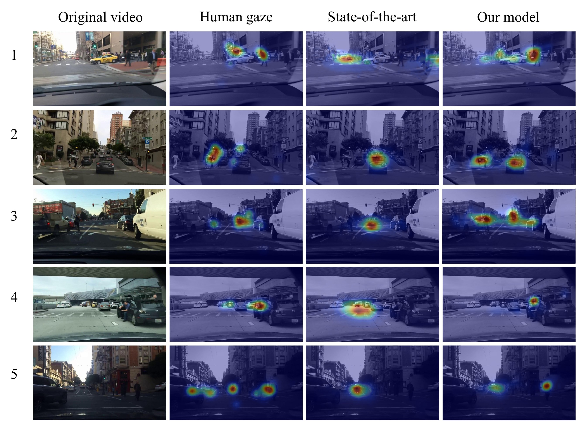

# Driver Attention Prediction Model

## Project Introduction:

This project accompanies the paper https://arxiv.org/abs/1711.06406

##Demo

Videos: https://youtu.be/IcAtJ0CvYuQ

## Using Our Code:
### Installation
Make sure you have nvdia-docker installed. Then you can just use the docker image blindgrandpa/tf130_keras to run our code.

### Use our model to do inference on your videos
If you want to use our model to generate predicted driver attention maps for your videos, please follow the steps below. 

1. Put your videos into the directory ./data/application/camera_videos/

2. Parse your videos into frames. Modify the parameter settings in parse_video.py to specify the suffix of your video files and at which frame rate you want to generate prediction. A sampling rate of 3 Hz is recommended.

